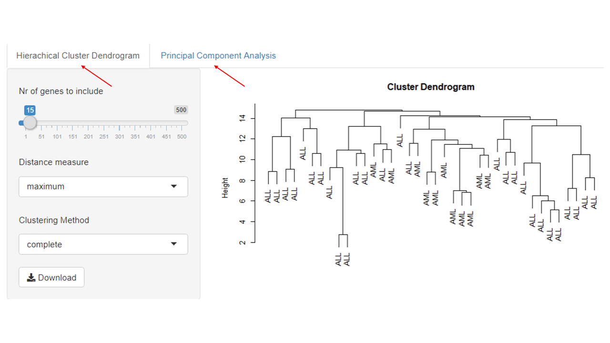
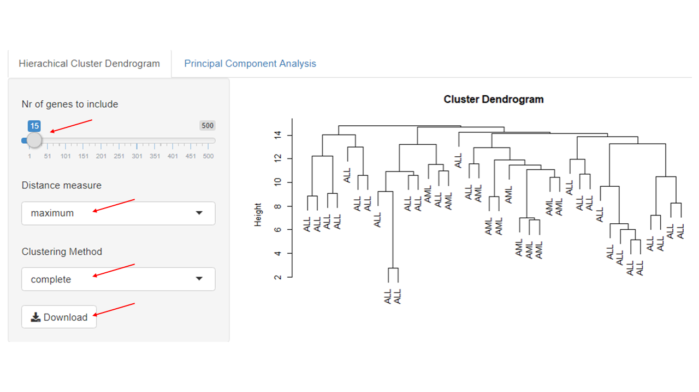
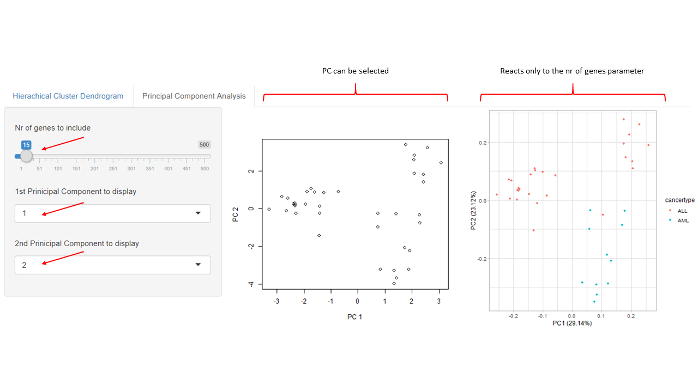

<!-- README.md is generated from README.Rmd. Please edit that file -->

```{r, include = FALSE}
knitr::opts_chunk$set(
  collapse = TRUE,
  comment = "#>",
  fig.path = "man/figures/README-",
  out.width = "100%"
)
```

# PPClustA

<!-- badges: start -->
<!-- badges: end -->

The PPClustA package contains a shiny APP to explore and visualize Gene expression data of Acute Lymphatic Leukemia (ALL) and Acute Myeloid Leukemia (AML) patients from Golub et al. applying Principal Component Analysis and Hierarchical Clustering methods.  

## Required Packages
* [cluster](https://cran.r-project.org/package=cluster)
* [dplyr](https://cran.r-project.org/web/packages/dplyr/index.html)
* [ggfortify](https://cran.r-project.org/package=ggfortify)
* [GolubEsets](https://doi.org/doi:10.18129/B9.bioc.golubEsets)
* [Shiny](https://shiny.rstudio.com/)
* [tibble](https://www.rdocumentation.org/packages/tibble/versions/3.1.0)

## Installation

You can install the current version of PPClustA from [GitHub](https://github.com/ECSchmitt/PPClustA) using [devtools](https://cran.r-project.org/web/packages/devtools/index.html) install_github() function:

``` r
if(!requireNamespace("devtools", quietly = TRUE))
  install.packages("devtools")
  
devtools::install_github("ECSchmitt/PPClustA")
```


## Some Theory behind the Package
Looking at [expression data](https://en.wikipedia.org/wiki/Gene_expression_profiling) of many genes across many individuals we are confronted with a vast amount of information. Such data is multidimensional and therefore needs to be simplified to become comprehensible to us without losing important information. In case of the Golub data the authors were interested in finding and distinguishing new cancer sub-types. But how can we use expression data to define cancer sub-types?

### Measuring Distances
 To tackle this problem we need to find a measure allowing us to determine similarities between the expression [vectors](https://en.wikipedia.org/wiki/Vector_(mathematics_and_physics)) per patient and gene enabling us to group similar vectors together. A measure providing this functionality is the distance between two vectors. Similar distances indicate closer feature vectors within vector space. A few example for such measures are: 

* [Euclidean](https://en.wikipedia.org/wiki/Euclidean_distance)
* [Manhattan](https://en.wikipedia.org/wiki/Taxicab_geometry)
* [Maximum](https://en.wikipedia.org/wiki/Chebyshev_distance)
* [Minkowski](https://en.wikipedia.org/wiki/Minkowski_distance)

To calculate a distance matrix you need some kind of input that the dist() function of R can handle. Such an input is either a two dimensional matrix or a vector. Both have to have numeric types. A random 6*6 numerical matrix can be produced as follows

```r
#producing a 6*6 matrix with random values
matrix <- matrix(rnorm(36), nrow = 6)
```
```{r echo = FALSE}
matrix <- matrix(rnorm(36), nrow = 6)
matrix
```

To obtain a distance between the matrix columns (in case of a matrix input) or the vector members (in case of
a vector input) one has to apply R's dist() method.  It can be called with different distance measures  like "euclidean", "manhattan","maximum" and others (use ?dist() to obtain a full list of available measurements). An example for how a distance matrix is calculated from a 6*6 matrix filled with random values is depicted below.

``` r
#producing a 6*6 matrix with random values
matrix <- matrix(rnorm(36), nrow = 6)

#calculating a distance matrix
distance_matrix <- dist(matrix, method = "euclidean")
```
```{r echo = FALSE}
distance_matrix <- dist(matrix, method = "euclidean")
distance_matrix

```

### Hierarchical Clustering
[Hierachical clustering](https://en.wikipedia.org/wiki/Hierarchical_clustering) can either be agglomerating (bottom-up) or divisive (top-down). Bottom-up approaches start with all observations in one cluster and iteratively group nearby clusters together until one large cluster is formed. Top-down approaches start with all observations within one cluster and separate this cluster subsequently into smaller clusters until every observation is within its own cluster. Visualization is done by using a dendrogram where straight lines depict distance between clusters and horizontal lines group similar clusters together. To obtain such a dendrogram it is crucial to determine the distance between the newly formed clusters in every iteration step. Examples for such measures are listed below. Please follow the links for information in more detail.

* [Single linkage](https://en.wikipedia.org/wiki/Single-linkage_clustering) finds the minimum distance between points belonging to two different clusters
* [Complete linkage](https://en.wikipedia.org/wiki/Complete_linkage) determines the maximum distance between points to two different clusters
* [Average linkage (UPGMA)](https://en.wikipedia.org/wiki/UPGMA) calculates all pairwise distances of point in two different clusters and takes the average
* [Average linkage (WPGMA)](https://en.wikipedia.org/wiki/WPGMA) similar to UPGMA but with weighted distances
* [Centroid](https://en.wikipedia.org/wiki/Cluster_analysis#Centroid-based_clustering) finds the centroid of each cluster and determines distance between centroids of two different clusters
* [Ward](https://en.wikipedia.org/wiki/Ward%27s_method) minimizes the overall distance

Given a distance matrix hierarchical clustering methods can be applied via R's hclust() function. Within hclust() the "method" parameter takes a string object indicating the required clustering formula ("single", "complete"...). Printing an object produced by hclust() via the print() function produces a  dendrogram depicting the distances of all clusters.

```r
#producing a 6*6 matrix with random values
matrix <- matrix(rnorm(36), nrow = 6)

#calculating a distance matrix
distance_matrix <- dist(matrix, method = "euclidean")

#applying hierarchical clustering
hc <- hclust(distance_matrix, method = "single")

#printing the clustering
print(hc)

```
```{r, echo = FALSE}
matrix <- matrix(rnorm(36), nrow = 6)
distance_matrix <- dist(matrix, method = "euclidean")
hc <- hclust(distance_matrix, method = "single")
plot(hc, xlab = "")
```

### Principal Component Analysis
A gene expression matrix provides a multidimensional space across numerous features. It is not trivial presenting such data in a way that we can easily comprehend it as we are only familiar with 2 dimensional plotting. [Principal Component Analysis](https://www.huber.embl.de/msmb/Chap-Multivariate.html) is a way to reduce the dimension and plot the reduced data into 2 dimensional space. To achieve this, observations are projected onto vectors producing lines with respect to keeping the distances between points and line low while covering as much variance as possible. This procedure generates linear combinations of observation vectors called principal components (PC). These (PC) are then plotted into a two dimensional space. Usually, the two PC covering the largest variances are plotted as they are likely to represent the most important features.

```r
# prducing a 100*100 matrix with random values
matrix <- matrix(rnorm(1000), nrow = 100)

#calculating a distance matrix
distance_matrix <- dist(matrix, method = "euclidean")

#calculating PCA
pca <- prcomp(distance_matrix)

#plotting pca
plot(pca$x)

```
```{r, echo = FALSE}
matrix <- matrix(rnorm(1000), nrow = 100)
distance_matrix <- dist(matrix, method = "euclidean")
pca <- prcomp(distance_matrix)
plot(pca$x)
```

You might now be disappointed by the sample image above as it doesn't show fancy patterns. Since we use a randomly distributed matrix in our example, the distances between column vectors are likely to be quite similar and therefor the PCA may not contain interesting patterns. To investigate whether that is true, one can plot the principal components as a histogram to find out whether their contained variance is is similar. Such a plot can is part of a PCA object produced by prcomp() and can be plotted as follows:
```r
# prducing a 100*100 matrix with random values
matrix <- matrix(rnorm(1000), nrow = 100)

#calculating a distance matrix
distance_matrix <- dist(matrix, method = "euclidean")

#calculating PCA
pca <- prcomp(distance_matrix)

#plotting pc histogram
plot(pca)
```
```{r echo = FALSE}
matrix <- matrix(rnorm(1000), nrow = 100)
distance_matrix <- dist(matrix, method = "euclidean")
pca <- prcomp(distance_matrix)
plot(pca)
```

## Starting the Shiny Application and using Reactive Components

This Package was built to enable users to explore and visualize hierarchical clustering methods and principal component analysis on well know benchmark data. For this purpose a shiny app was included in it which can be started after loading the package.

### Running the App
To start the shiny app, load the PPClustA library and call the PPClustA::runapp() function

```r
library(PPClustA)
PPClustA::runapp()
```

### Reactive components
Calling the runapp function starts a shiny dashboard comprised of two tabs which can be selected by clicking on them with the mouse cursor. The active tab will appear grey while the inactive one will stay blue until clicked. For better orientation see figure below.


Within the "Hierarchical Clustering" tab you can find four interactive elements. On the top left side there is a slider which determines the number of genes to be included in calculating the distance matrix between patients. It can be adjusted to any integer between 1 to 500. Below that slider there are the "Distance Measure" and the "Clustering Method" box in which one can select methods to be applied during distance matrix calculation and hierarchical clustering computation. Be invited to play around with them and observe how the plot on the right side changes. Finally, you can find a download button bottom left which allows you to export the produced plot as .pdf file. For a detailed overview or in case you struggle with finding one of the mention options please have a look at the figure below.

The "Principal Component" tab contains a slider in the top left as well. Similar to the one mentioned before, the amount of genes included in computing a PCA can be selected with it. Within the plot area two plots are displayed this time. The left one plots two principal components chosen by the user an reacts to the amount of genes slider as well as to the two selection boxes below. Choose any of the 15 principal components, plot them against each other and see what happens! To add a more colorful plot the right graph shows the same PCA but will always represent the first two principal components. To compensate for this lack in activity, the data points within the graph are colored according to the cancer-type of the underlying patient and the covered variance is plotted behind the axis labels.

## Functions of other Packages used within PPClustA

base

* [t()](https://www.rdocumentation.org/packages/base/versions/3.6.1/topics/t)
* [log2()](https://www.rdocumentation.org/packages/base/versions/3.6.2/topics/log)
* [apply()](https://www.rdocumentation.org/packages/base/versions/3.6.2/topics/apply)
* [sort()](https://www.rdocumentation.org/packages/base/versions/3.6.2/topics/sort)
* [paste()](https://www.rdocumentation.org/packages/base/versions/3.6.2/topics/paste)

dplyr

* imported to use the pipe-operator ( [%>%](https://www.datacamp.com/community/tutorials/pipe-r-tutorial) ). 

graphics

* [plot()](https://www.rdocumentation.org/packages/graphics/versions/3.6.2/topics/plot)

ggfortify

* [autoplot](https://www.rdocumentation.org/packages/ggplot2/versions/3.3.3/topics/autoplot)

Shiny

* [titlePanel()](https://www.rdocumentation.org/packages/shiny/versions/1.6.0/topics/titlePanel)
* [mainPanel()](https://www.rdocumentation.org/packages/shiny/versions/1.2.0/topics/mainPanel)
* [sidebarPanel()](https://shiny.rstudio.com/reference/shiny/0.11/sidebarPanel.html)
* [sidebarLayout()](https://www.rdocumentation.org/packages/shiny/versions/1.6.0/topics/sidebarLayout)
* [tabsetPanel()](https://www.rdocumentation.org/packages/shiny/versions/1.6.0/topics/tabsetPanel)
* [tabPanel()](https://shiny.rstudio.com/reference/shiny/latest/tabPanel.html)
* [selectInput()](https://www.rdocumentation.org/packages/shiny/versions/1.6.0/topics/selectInput)
* [sliderInput()](https://www.rdocumentation.org/packages/shinybootstrap2/versions/0.2.1/topics/sliderInput)
* [fluidRow()](https://shiny.rstudio.com/articles/layout-guide.html)
* [renderPlot()](https://www.rdocumentation.org/packages/shiny/versions/1.6.0/topics/renderPlot)
* [downloadHandler()](https://www.rdocumentation.org/packages/shiny/versions/1.6.0/topics/downloadHandler)
* [downloadButton()](https://www.rdocumentation.org/packages/shiny/versions/1.6.0/topics/downloadButton)

Stats

* [dist()](https://www.rdocumentation.org/packages/stats/versions/3.6.2/topics/dist)
* [hclust()](https://www.rdocumentation.org/packages/stats/versions/3.6.2/topics/hclust)
* [prcomp()](https://www.rdocumentation.org/packages/stats/versions/3.6.2/topics/prcomp)

Tibble

* [rownames()](https://www.rdocumentation.org/packages/tibble/versions/3.1.0/topics/rownames)
* [add_column()](https://www.rdocumentation.org/packages/tibble/versions/3.1.0/topics/add_column)

