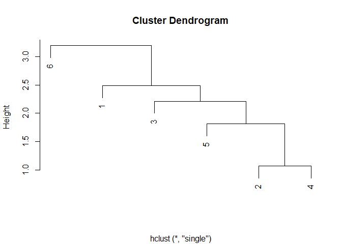
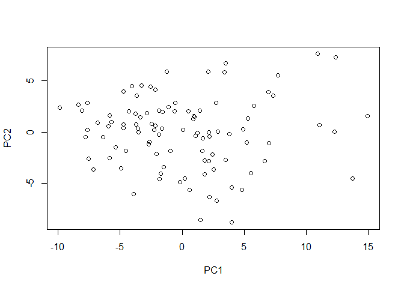
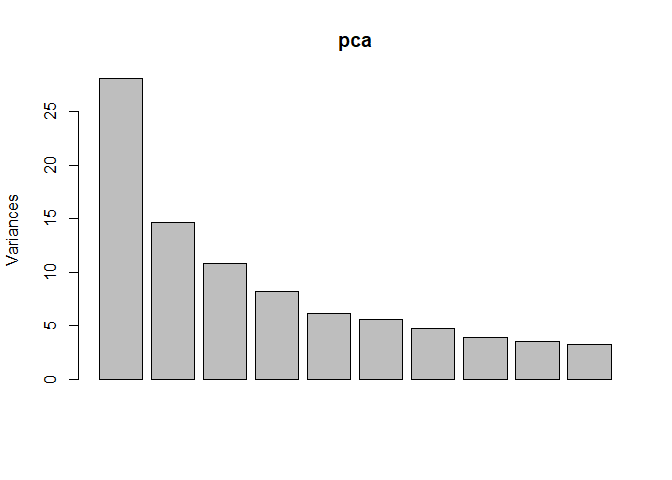

<!-- README.md is generated from README.Rmd. Please edit that file -->

# PPClustA

<!-- badges: start -->
<!-- badges: end -->

The PPClustA package contains a shiny APP to explore and visualize Gene
expression data of Acute Lymphatic Leukemia (ALL) and Acute Myeloid
Leukemia (AML) patients from Golub et al. applying Principal Component
Analysis and Hierarchical Clustering methods.

## Required Packages

-   [cluster](https://cran.r-project.org/package=cluster)
-   [diplyr](https://cran.r-project.org/web/packages/dplyr/index.html)
-   [ggfortify](https://cran.r-project.org/package=ggfortify)
-   [GolubEsets](https://doi.org/doi:10.18129/B9.bioc.golubEsets)
-   [Shiny](https://shiny.rstudio.com/)
-   [tibble](https://www.rdocumentation.org/packages/tibble/versions/3.1.0)

## Installation

You can install the current version of PPClustA from
[GitHub](https://github.com/ECSchmitt/PPClustA) using
[devtools](https://cran.r-project.org/web/packages/devtools/index.html)
install\_github() function:

``` r
if(!requireNamespace("devtools", quietly = TRUE))
  install.packages("devtools")
  
devtools::install_github("ECSchmitt/PPClustA")
```

## Running the App

To start the shiny app load the PPClustA library and call the
PPClustA::runapp() function

``` r
library("PPClustA")

PPClustA::runapp()
```

## Some Theory behind the package

Looking at [expression
data](https://en.wikipedia.org/wiki/Gene_expression_profiling) of many
genes across many individuals we are confronted with a vast amount of
information. Such data is multidimensional and therefore needs to be
simplified to become comprehensible to us without losing important
information. In case of the Golub data the authors were interested in
finding and distinguishing new cancer sub-types. But how can we use
expression data to define cancer sub-types?

### Measuring Distances

To tackle this problem we need to find a measure allowing us to
determine similarities between the expression
[vectors](https://en.wikipedia.org/wiki/Vector_(mathematics_and_physics))
per patient and gene enabling us to group similar vectors together. A
measure providing this functionality is the distance between two
vectors. Similar distances indicate closer feature vectors within vector
space. A few example for such measures are:

-   [Euclidean](https://en.wikipedia.org/wiki/Euclidean_distance)
-   [Manhattan](https://en.wikipedia.org/wiki/Taxicab_geometry)
-   [Maximum](https://en.wikipedia.org/wiki/Chebyshev_distance)
-   [Minkowski](https://en.wikipedia.org/wiki/Minkowski_distance)

To calculate a distance matrix you need some kind of input that the
dist() function of R can handle. Such an input is either a two
dimensional matrix or a vector. Both have to have numeric types. A
random 6\*6 numerical matrix can be produced as follows

``` r
#producing a 6*6 matrix with random values
matrix <- matrix(rnorm(36), nrow = 6)
```

    #>            [,1]       [,2]         [,3]       [,4]        [,5]        [,6]
    #> [1,]  0.8823301 -0.2803960  1.646177158  0.8089389  1.03290233  2.10287832
    #> [2,] -0.6381656 -1.5190047 -0.007113005 -2.1820147 -0.07160581  0.49954208
    #> [3,]  1.6254155  0.9057499 -0.038640042 -1.1358802 -0.40184299 -0.92256409
    #> [4,]  0.9606842 -1.1697382  0.305296802  2.3113424  0.22442014  0.04433023
    #> [5,] -1.0480815 -0.3179402 -0.351158958  1.2508414 -0.39537050 -0.23964188
    #> [6,] -3.1958999 -1.0970916 -0.610598206 -0.1754054 -0.01905454 -0.68451492

To obtain a distance between the matrix columns (in case of a matrix
input) or the vector members (in case of a vector input) one has to
apply R’s dist() method. It can be called with different distance
measures like “euclidean”, “manhattan”,“maximum” and others (use ?dist()
to obtain a full list of available measurements). An example for how a
distance matrix is calculated from a 6\*6 matrix filled with random
values is depicted below.

``` r
#producing a 6*6 matrix with random values
matrix <- matrix(rnorm(36), nrow = 6)

#calculating a distance matrix
distance_matrix <- dist(matrix, method = "euclidean")
```

    #>          1        2        3        4        5
    #> 2 4.394981                                    
    #> 3 4.448803 3.772276                           
    #> 4 3.121459 4.822967 4.251852                  
    #> 5 3.929363 3.763598 3.860769 2.604050         
    #> 6 5.677772 3.537717 5.358106 4.989563 2.767890

### Hierarchical Clustering

[Hierachical
clustering](https://en.wikipedia.org/wiki/Hierarchical_clustering) can
either be agglomerating (bottom-up) or divisive (top-down). Bottom-up
approaches start with all observations in one cluster and iteratively
group nearby clusters together until one large cluster is formed.
Top-down approaches start with all observations within one cluster and
separate this cluster subsequently into smaller clusters until every
observation is within its own cluster. Visualization is done by using a
dendrogram where straight lines depict distance between clusters and
horizontal lines group similar clusters together. To obtain such a
dendrogram it is crucial to determine the distance between the newly
formed clusters in every iteration step. Examples for such measures are
listed below. Please follow the links for information in more detail.

-   [Single
    linkage](https://en.wikipedia.org/wiki/Single-linkage_clustering)
    finds the minimum distance between points belonging to two different
    clusters
-   [Complete linkage](https://en.wikipedia.org/wiki/Complete_linkage)
    determines the maximum distance between points to two different
    clusters
-   [Average linkage (UPGMA)](https://en.wikipedia.org/wiki/UPGMA)
    calculates all pairwise distances of point in two different clusters
    and takes the average
-   [Average linkage (WPGMA)](https://en.wikipedia.org/wiki/WPGMA)
    similar to UPGMA but with weighted distances
-   [Centroid](https://en.wikipedia.org/wiki/Cluster_analysis#Centroid-based_clustering)
    finds the centroid of each cluster and determines distance between
    centroids of two different clusters
-   [Ward](https://en.wikipedia.org/wiki/Ward%27s_method) minimizes the
    overall distance

Given a distance matrix hierarchical clustering methods can be applied
via R’s hclust() function. Within hclust() the “method” parameter takes
a string object indicating the required clustering formula (“single”,
“complete”…). Printing an object produced by hclust() via the print()
function produces a dendrogram depicting the distances of all clusters.

``` r
#producing a 6*6 matrix with random values
matrix <- matrix(rnorm(36), nrow = 6)

#calculating a distance matrix
distance_matrix <- dist(matrix, method = "euclidean")

#applying hierarchical clustering
hc <- hclust(distance_matrix, method = "single")

#printing the clustering
print(hc)
```



### Principal Component Analysis

A gene expression matrix provides a multidimensional space across
numerous features. It is not trivial presenting such data in a way that
we can easily comprehend it as we are only familiar with 2 dimensional
plotting. [Principal Component
Analysis](https://www.huber.embl.de/msmb/Chap-Multivariate.html) is a
way to reduce the dimension and plot the reduced data into 2 dimensional
space. To achieve this, observations are projected onto vectors
producing lines with respect to keeping the distances between points and
line low while covering as much variance as possible. This procedure
generates linear combinations of observation vectors called principal
components (PC). These (PC) are then plotted into a two dimensional
space. Usually, the two PC covering the largest variances are plotted as
they are likely to represent the most important features.

``` r
# prducing a 100*100 matrix with random values
matrix <- matrix(rnorm(1000), nrow = 100)

#calculating a distance matrix
distance_matrix <- dist(matrix, method = "euclidean")

#calculating PCA
pca <- prcomp(distance_matrix)

#plotting pca
plot(pca$x)
```

 You
might now be disappointed by the sample image above as it doesn’t show
fancy patterns. Since we use a randomly distributed matrix in our
example, the distances between column vectors are likely to be quite
similar and therefor the PCA may not contain interesting patterns. To
investigate whether that is true, one can plot the principal components
as a histogram to find out whether their contained variance is is
similar. Such a plot can is part of a PCA object produced by prcomp()
and can be plotted as follows:

``` r
# prducing a 100*100 matrix with random values
matrix <- matrix(rnorm(1000), nrow = 100)

#calculating a distance matrix
distance_matrix <- dist(matrix, method = "euclidean")

#calculating PCA
pca <- prcomp(distance_matrix)

#plotting pc histogram
plot(pca)
```



## Variables in Shiny and their impact on visualisation
